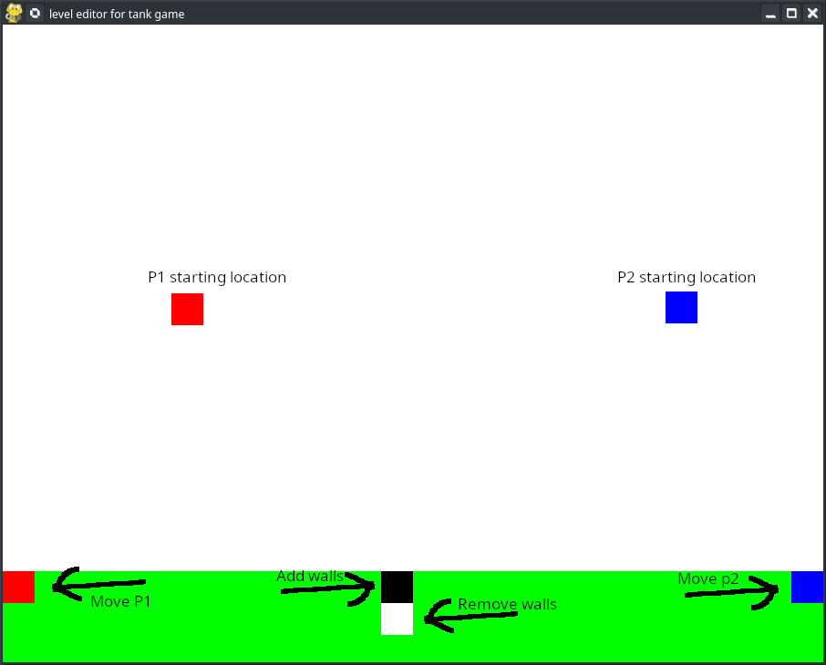

## intro

this is a simple multiplayer 1v1 pvp game made in python
  
this project is work in progress so everything does not work yet
  
other features
  
level editor  

  

  

  

  

# playing the game
  

## making a map

  
this is the level editor
it is in leves/level_editor.py
  
by pressing the buttons on the ui you can choose to move the player starting points or add and remove walls  
when you are ready press the "s" key to save your map to gamelevel.json
move this json file to the same folder as server.py  
  
  

## getting the game working

start server.py, then connect the clients, when you start client.py you will get an empty window  
and the terminal will prompt you to enter an ip address. the server will say hostin on ... enter that ip adress 
when both players are connected you can styart playing  
mouse click to move and "f" to fire
  

  

  
## NEEDED PIP PACKAGES

just run "pip3 install *package_name*"

json  
sockets  
pygame  
threading  

  

## KNOWN ISSUES
    
  
"minor" desync issues

